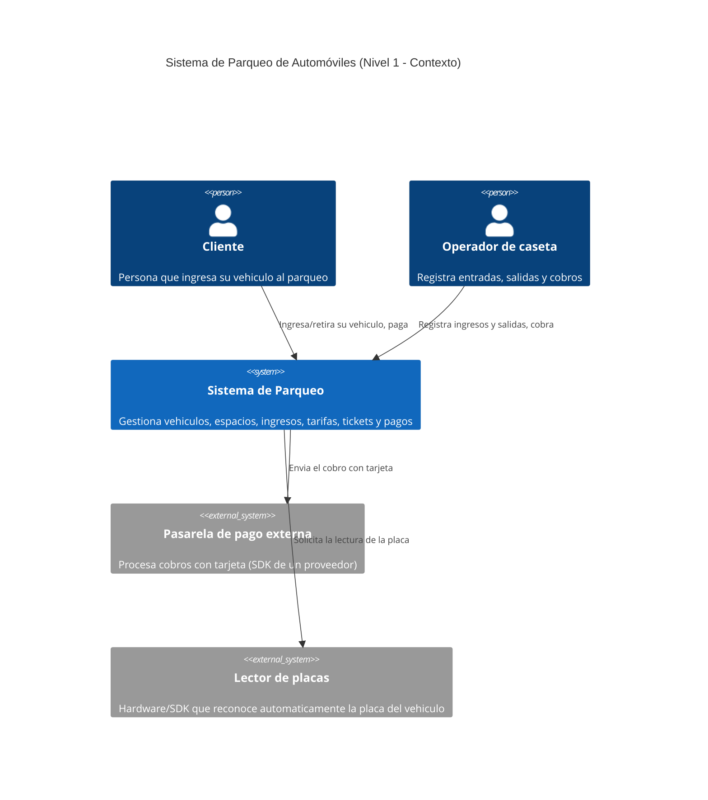
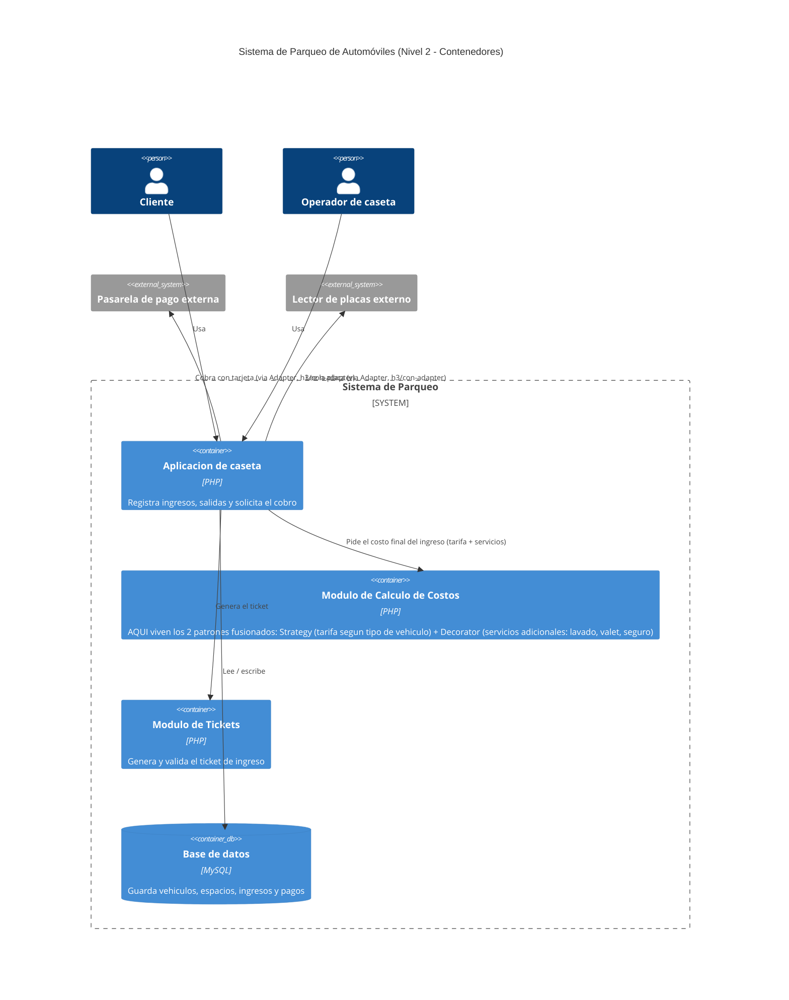

# H4 — Documentación de la decisión (Sistema de Parqueo "San Rafael")

## C4 — Nivel 1: Contexto

## C4 — Nivel 2: Contenedores

El **Módulo de Cálculo de Costos** es donde conviven los dos patrones
fusionados en `h3/final/`: `ServicioBasico` usa una `CalculadoraTarifa`
(Strategy) para el costo base según el tipo de vehículo, y los decoradores
(`ConLavado`, `ConValet`, `ConSeguroAdicional`) envuelven ese resultado para
sumar cualquier combinación de servicios adicionales.
