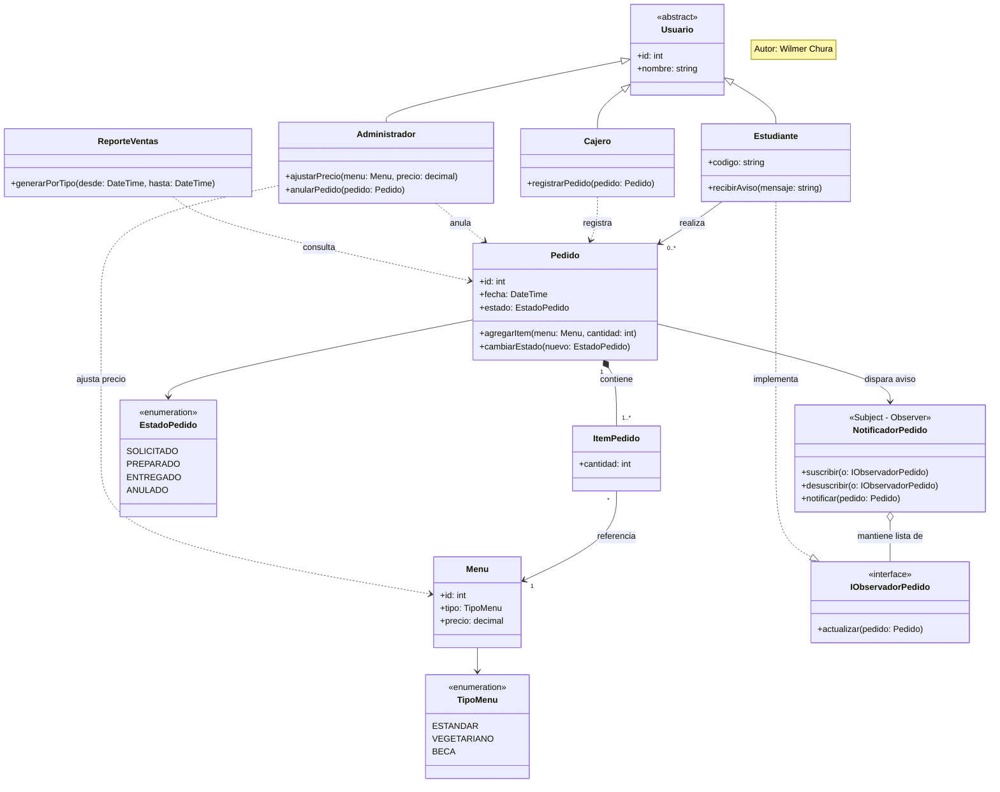

# Parte 1 — Diagrama de clases (Comedor Universitario "Sabor Andino")

**Autor:** Wilmer Chura

## Receta de 4 pasos

**1. Sustantivos** (candidatos a clase): estudiante, pedido, menú, tipo de menú, cajero, administrador,
estado del pedido, aviso, reporte.

**2. Verbos** (candidatos a método): pedir menú, registrar pedido, cambiar estado del pedido,
ajustar precio, anular pedido, notificar/avisar al estudiante, generar reporte de ventas.

**3. Filtro**: se descartan sustantivos que son solo atributos de otra clase (ej. "tipo de menú" pasa
a ser un enum dentro de `Menu`, no una clase propia). Se agrupan Cajero y Administrador bajo una
clase base `Usuario` porque comparten identidad y difieren en permisos/acciones.

**4. Relaciones**: un `Pedido` pertenece a un `Estudiante` (1 a muchos); un `Pedido` se compone de uno
o más `ItemPedido`, cada uno referenciando un `Menu`; el `Cajero` registra pedidos, el `Administrador`
ajusta precios y anula pedidos; cuando un `Pedido` pasa a `PREPARADO`, un `NotificadorPedido` (patrón
Observer, ver `patron.md`) avisa al `Estudiante`; `ReporteVentas` consulta los `Pedido` para agrupar
por tipo de menú.

## Diagrama

## Coherencia con la Parte 3 (patrón)

Las clases `NotificadorPedido` e `IObservadorPedido` en este diagrama **son** el patrón Observer
aplicado en `patron.md`: `Pedido` es el sujeto observado (indirectamente, a través de
`NotificadorPedido`) y `Estudiante` es el observador concreto que reacciona cuando el pedido
cambia a `PREPARADO`.
